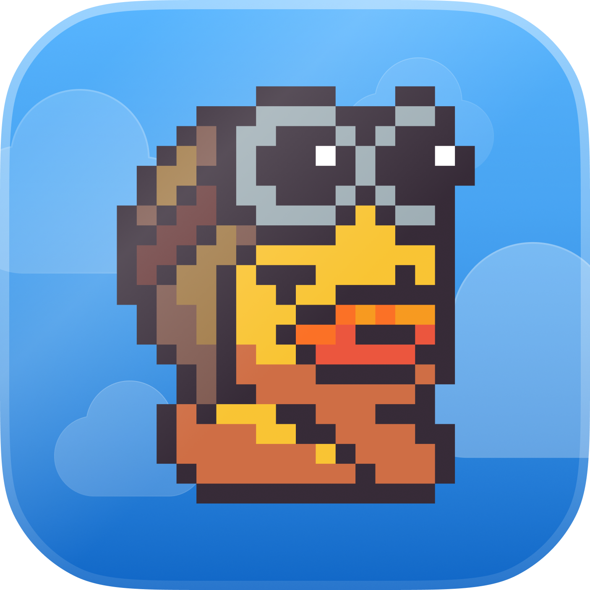

<p align="center">
  
</p>

<h1 align="center">Quakpit 🦆✈️</h1>

<p align="center">
  A little duck in a plane flies across your screen, above every app, towing a banner that<br/>
  reminds you of your next meeting — with a plane engine sound. Fully automatic from your calendar.
</p>

<p align="center">
  <strong>Free &amp; open source.</strong> macOS · UI in English.<br/>
  A project by <a href="https://ooble.studio"><strong>Ooble Studio</strong></a> 🐣
</p>

<p align="center">
  
  
  
  <a href="https://x.com/ooblestudio"></a>
</p>

---

## 🐤 Made by Ooble Studio

Quakpit is built and given away **for free** by **[Ooble Studio](https://ooble.studio)** — a design
studio specializing in **UX, branding & motion design** for **Web3 and AI** products. Quakpit is our
little open-source gift to your desktop; if it makes you smile, come see what we craft for clients at
**[ooble.studio](https://ooble.studio)**.
📣 Follow along on **[X / Twitter (@ooblestudio)](https://x.com/ooblestudio)**.

> Quakpit stays free and open source. There's an optional **Pro** unlock (extra characters, plane
> colours, sounds, themes and flight speeds) that funds the studio — but the whole free app, the one
> in this repo, is yours, forever.

## What it does

Once it's running (it lives quietly in your **menu bar**), Quakpit watches your calendar and, a few
minutes before each meeting, sends the duck flying across **every** app you have open — towing a
banner like _"Call with Jack in 5 minutes"_, with an engine drone and a quack. That's it. No window
to manage, no notification to dismiss.

- **Send a test flight** anytime — or press **⌘⇧D**
- Works with **Google Calendar** and **iCloud**
- Set the lead time, the message, the sound

## Privacy — zero data

Quakpit has **no server** and **no database**. It talks **directly** to Google / Apple from your
machine. Calendar events are kept **in memory only** and never written to disk. The only things that
can be stored locally are your OAuth refresh token and (if you go Pro) your license — **encrypted by
the OS** (Keychain). No telemetry, no analytics. Ever.

## Download

Grab the latest **macOS** build from the [**Releases**](../../releases) page (or from
[ooble.studio](https://ooble.studio)).


## Open source & Pro

Quakpit is **open-core**. This repository is the **complete free app** — MIT-licensed and fully
functional on its own. **Pro** adds extra plane colours, animal characters & sounds, banner themes
and flight speeds, unlocked with a license key; their artwork/sounds aren't part of this repo. The
license check is here and only talks to [Polar](https://polar.sh)'s **public** endpoints — no secret
ships in the app.

## Develop

```bash
npm install
npm run dev      # run from YOUR terminal (not an automated shell)
npm run build    # production build into ./out
```

> Heads-up: if your shell sets `ELECTRON_RUN_AS_NODE=1`, Electron won't open a GUI. Use a normal
> terminal, or run `env -u ELECTRON_RUN_AS_NODE npm run dev`.

### Connect Google Calendar (one-time setup)

You need your own Google OAuth client (so nothing routes through anyone else):

1. <https://console.cloud.google.com/> → create a project.
2. **APIs & Services → Library** → enable **Google Calendar API**.
3. **OAuth consent screen** → External. Add the scope `.../auth/calendar.events.readonly`. While
   testing, add your account under **Test users** (no verification needed for up to 100 testers).
4. **Credentials → Create credentials → OAuth client ID → Desktop app**.
5. Copy `oauth-credentials.example.json` to **`oauth-credentials.json`** and paste your
   `clientId` / `clientSecret`. (For desktop apps the secret is not confidential; the file is gitignored.)

Then: **Settings… → Calendar → Google Calendar → Connect**.

### Connect iCloud (no Cloud Console needed)

iCloud uses **CalDAV** with an **app-specific password**:

1. <https://appleid.apple.com> → **Sign-In & Security → App-Specific Passwords** → generate one.
2. In Quakpit: **Settings… → Calendar → iCloud** → Apple ID + that password → **Connect**.

The password is stored **encrypted on your device** (Keychain), used only to read your calendars over
HTTPS directly from Apple.

### Build a macOS app

```bash
npm run dist:mac   # -> dist/Quakpit-<version>-universal.dmg
```

For an unsigned local test build: `npm run build && CSC_IDENTITY_AUTO_DISCOVERY=false npx electron-builder --dir`.
A signed/notarized build (warning-free download + auto-update) needs an Apple Developer account
($99/yr) and a _Developer ID Application_ certificate; set `APPLE_ID` / `APPLE_APP_SPECIFIC_PASSWORD`
/ `APPLE_TEAM_ID` and `mac.notarize: true` in `electron-builder.yml`.

## Project layout

```
src/main/        Electron main process (windows, tray, calendar, scheduler, store, license)
src/preload/     Safe bridge exposed to the renderers
src/renderer/    overlay (the flight) + settings (the form)
scripts/         tray + app icon generators
site/            static download / landing page
```

## License

[MIT](LICENSE) © [Ooble Studio](https://ooble.studio)

<p align="center"><sub>Made with 🧡 by <a href="https://ooble.studio">Ooble Studio</a></sub></p>
